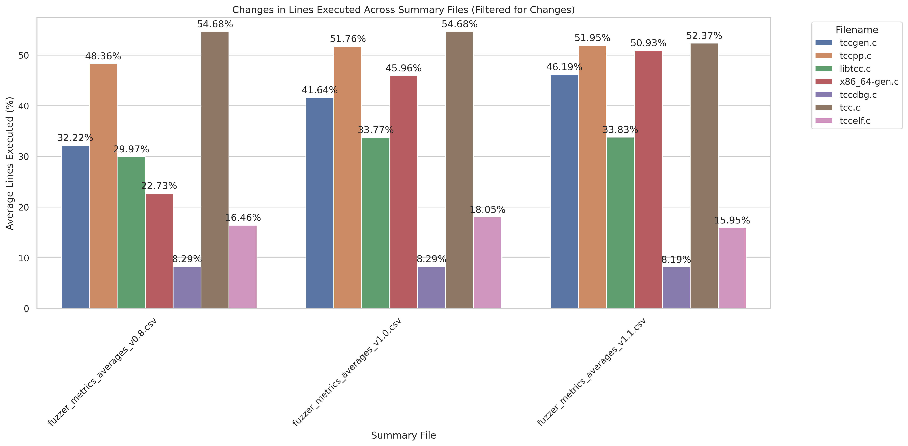

# go-fuzz-tcc

## How to generate random C code

To simply generate some `.c` code, you do

```bash
go run main.go
```

This will generate a randomly generated `.c` file called `output.c`.

This C code is based on our subset of C

## How to find out the code coverage?

You must have the tinycc repo at the same directory as `go-fuzz-tcc`

Then `cd` to `coverage/scripts` and run

```bash
bash coverage.sh
```

This will generate 10 C programs, that `tcc` will try to compile. When `tcc` is compiling it, it will generate some `.gcda` and `.gcno` files which can be used to calculate the code coverage of the input on the compiler.

After this, we generate a `.csv` file with the average of these C programs, and plot these results in the following [plot](coverage/graphs/summary_lines_executed_plot.png) 